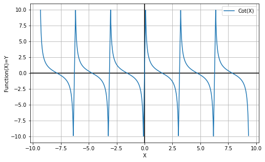

# Лабораторная работа №2

Выполнили: Анищенко А.А., Федоров С.Д.

Преподаватель: Дмитриева А.М.

Санкт-Петербург, 2021

Задание
=======
* Все составляющие систему функции (как тригонометрические, так и логарифмические) должны быть выражены через базовые (тригонометрическая зависит от варианта; логарифмическая -- натуральный логарифм).
* Структура приложения, тестируемого в рамках лабораторной работы, должна выглядеть следующим образом (пример приведён для базовой тригонометрической функции `sin(x)`):

* Обе "базовые" функции (в примере выше - `sin(x)` и `ln(x)`) должны быть реализованы при помощи разложения в ряд с задаваемой погрешностью. Использовать тригонометрические / логарифмические преобразования для упрощения функций ЗАПРЕЩЕНО.
* Для КАЖДОГО модуля должны быть реализованы табличные заглушки. При этом, необходимо найти область допустимых значений функций, и, при необходимости, определить взаимозависимые точки в модулях.
* Разработанное приложение должно позволять выводить значения, выдаваемое любым модулем системы, в `сsv` файл вида «X, Результаты модуля (X)», позволяющее произвольно менять шаг наращивания Х. Разделитель в файле `csv` можно использовать произвольный.

Вариант
=======

Функция
======

`F1(x), x <= 0`
Периодическая функция с периодом `2pi`. Функция состоит из 2 частей, каждая часть
которой уходит в бесконечность. Для тестирования были проверены все граничные
точки (точки разрыва второго рода) и точки в каждом классе эквивалентности и
проверена периодичность функций

`F2(x), x > 0`
Функция была протестирована во всех классах эквивалентности

Графики функций, полученные из экспериментальных данных:
==========

**f(x)**

Красным цветом выделены точки реального значений функции,
синим цветом построен график функции полученный в результате 
выполнения лабораторной. 

**y = sin(x)**

**y = cos(x)**

**y = tan(x)**

**y = cot(x)**

**y = ln(x)**

**y = log2(x)**

**y = log3(x)**

**y = log5(x)**

**Ход работы**

При тестировании были написаны тесты для проверки значений во всех классах
эквивалентности, разобраны значения в граничных точках, в точках разрывов первого и второго родов.

Тестирование проходило в 3 уровня: на первом уровне производилась проверка
работы системы функций без заглушек. На втором уровне заглушки устанавливались на базовые тригонометрические и
логарифмические функции (`ln(x)` и `sin(x)`), на третьем уровне -- на все тригонометрические и
логарифмические функции (`sin(x)`, `cos(x)`, `tan(x)`, `cot(x)`, `log_2(x)`, `log_3(x)` и `log_5(x)`; на `ln(x)` заглушка не ставилась, так как функция нигде не используется).
По полученным результатам были построены графики.

**Вывод**

В ходе выполнения лабораторной работы было проведено и изучено интеграционное
тестирование функции, были изучены основные принципы интеграционного
тестирования и была изучен фреймворк тестирования Mockito, при помощи которого
создавались табличные заглушки в ходе выполнения лабораторной работы.
