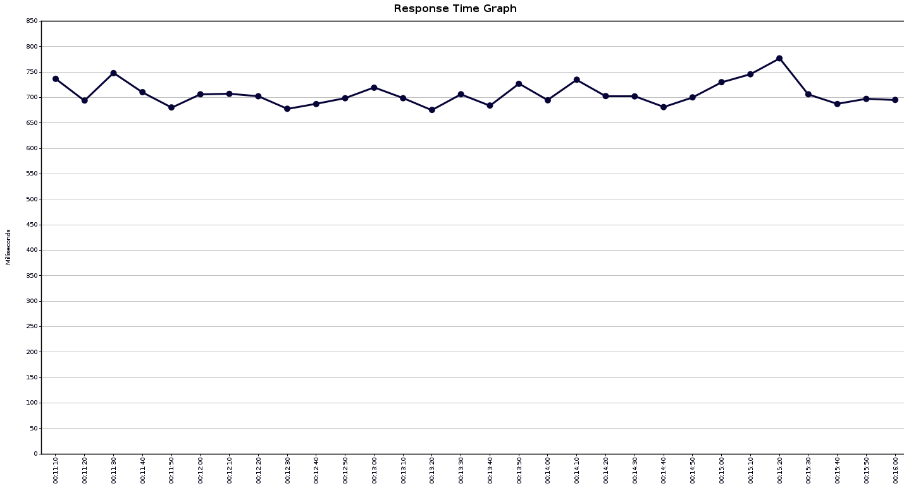

# Лабораторная работа №4   &laquo;Тестирование программного обеспечения&raquo;

### Задание

С помощью программного пакета [Apache JMeter](http://jmeter.apache.org/) провести нагрузочное и стресс-тестирование веб-приложения в соответствии с вариантом задания.

В ходе нагрузочного тестирования необходимо протестировать 3 конфигурации аппаратного обеспечения и выбрать среди них наиболее дешёвую, удовлетворяющую требованиям по максимальному времени отклика приложения при заданной нагрузке (в соответствии с вариантом).

В ходе стресс-тестирования необходимо определить, при какой нагрузке выбранная на предыдущем шаге конфигурация перестаёт удовлетворять требованиями по максимальному времени отклика. Для этого необходимо построить график зависимости времени отклика приложения от нагрузки.

**Webapp properties:**

 - First hardware configuration ($4900) URL - `http://aqua:8080?token=466636667&user=1964516632&conf=1;`
 - Second hardware configuration ($8000) URL - `http://aqua:8080?token=466636667&user=1964516632&conf=2;`
 - Third hardware configuration ($8900) URL - `http://aqua:8080?token=466636667&user=1964516632&conf=3;`
 
 - Maximum parallel sessions count - `8`;
 - Load average (requests per minute; per session) - `20`;
 - Maximum request processing timeout - `710 ms`.

### Работа с Apache JMeter

1. Описание конфигурации JMeter для нагрузочного тестирования.

   План теста:

   

   Описание количества пользователей

   

   Параметры HTTP-запроса

   

   Параметры пропускной способности

   

2. **Графики пропускной способности приложения, полученные в ходе нагрузочного тестирования.**

   График пропускной способности на первой конфигурации:

   
   

   График пропускной способности на второй конфигурации:

   
   

   График пропускной способности на третьей конфигурации:

   
   

3. **Выводы по выбранной конфигурации аппаратного обеспечения.**

   *Была выбрана вторая конфигурация.*

   Первая и третья конфигурация не соотвествует требованиям в `Maximum request processing timeout`

4. Описание конфигурации JMeter для стресс-тестирования.

   Описание конфигурации при прохождении стресс тестирования:

   

   Результаты тестирования:

   
   

   Первый отказ в обслуживании наступает примерно через 30 секунд после начала теста (кол-во пользователей = 150), при этом время отклика достигает 3,0-3,1 секунды. При количестве пользователей равном 75 время ответа системы составило 711 мс, что перестаёт удовлетворять условию максимального времени отклика

### Вывод

В ходе выполнения лабораторной работы было проведено нагрузочное тестирование для приложений 3-х конфигураций разной ценовой категории при помощи приложения Apache JMeter. В ходе тестирования было выявлено приложение с конфигурациями, которые удовлетворяют предоставленным требованиям и проведено стресс-тестирование для выбранного приложения, в ходе чего было определена максимальная пропускная способность выбранного приложения.